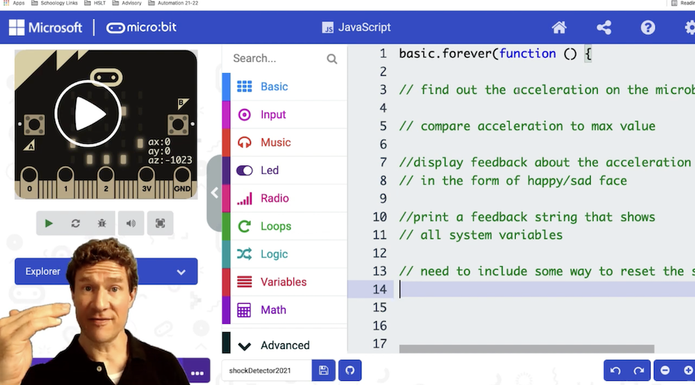

# Shockdetector

The question is described in these Videos from Mr. Weinberg: 

[Video 1](https://youtu.be/e2xGct1VtUk) (7:30) and [Video 2](https://youtu.be/P6WIrlO7Vno) (10:35)

 

We also have an [API description](https://docs.google.com/document/d/1n-AdkuavroyMzPZWvsoFD0uzaaGQqKvkenOW4S6F15o/edit) (incomplete Application Programming Interface) and a [student starter code](https://docs.google.com/document/d/1wTmN4Vld7YhsWqiCh0UvgKstFQewss1yAlwlfFfodJM/edit).

The task: Fix Mr. Weinbergs code for the micro:bit to detect shocks and protect the eggs.

## Raw Initial Code

Just 120 lines. In a document with more spaces [to be found here](https://docs.google.com/document/d/1wTmN4Vld7YhsWqiCh0UvgKstFQewss1yAlwlfFfodJM/edit)

``` js
//Paste the code below into a new project at https://makecode.microbit.org
let maxAccelerationWasExceeded = false

input.onButtonPressed(Button.A, function () {
    maxAccelerationWasExceeded = false
})

basic.forever(function () {
    //store readings from the accelerometer into an array variable
    //calculate the magnitude of acceleration from the array of accelerometer values
    //create an array of the three acceleration values and the magnitude
    //check if the acceleration magnitude is more than is allowed by the system
    //use this value to set the maximum acceleration was reached variable to be either true or false
    //display feedback about acceleration
    //for debugging purposes, print out a string that shows the acceleration, among other things

    //Include a brief pause of the system before looping again 
    basic.pause(5)
})

function readAccelerometer() {
    //To access the value of the acceleration sensor, you use the input.acceleration function.
    let ax = input.acceleration(Dimension.X)
    let ay = input.acceleration(Dimension.Y)
    let az = input.acceleration(Dimension.Z)

    //The sensor values are from -1023 to 1023, but the accelerometer can be scaled to be real world units.
    //The function scaleAccelerometerToMetersAndSeconds takes care of this conversion.
    let axScaled = scaleAccelerometerToMetersAndSeconds(ax)
    let ayScaled = scaleAccelerometerToMetersAndSeconds(ay)
    let azScaled = scaleAccelerometerToMetersAndSeconds(az)

    //This function returns an array of values, one for each direction x, y, z.
    return [axScaled, ayScaled, azScaled]
}

function calculateAccelerationMagnitude(values: number[]) {
    //To access information stored in arrays, you put the index of the information you want in brackets.
    //The first storage slot is 0, the second is 1, and so on.

    let ax = values[0]
    let ay = values[1]
    let az = values[2]

    //The magnitude of a 3D vector can be calculated by squaring each component, adding these squares,
    //and taking the square root.
    let aMagnitude = Math.sqrt(ax * ax + ay * ay + az * az)
    return aMagnitude
}

function scaleAccelerometerToMetersAndSeconds(accelerometerReading: number) {
    //This converts sensor values from the accelerometer (which are between -1023 to 1023) to real worlds values.
    let minimumAccelerometerReading = -1023
    let maximumAccelerometerReading = 1023
    let minimumAccelerometerValue = -9.81  //this is the acceleration of Earth's gravity on the surface downwards.
    let maximumAccelerometerValue = 9.81  //...and this is that same acceleration upwards.

    //The map function takes a value x, which is between A and B, and scales it to a value that is between C and D.
    let scaledValue = Math.map(accelerometerReading, minimumAccelerometerReading, maximumAccelerometerReading, minimumAccelerometerValue, maximumAccelerometerValue)

    return scaledValue
}

function isAccelerationMoreThanIsAllowed(accelerationMagnitude: number) {
    let maximumAllowedAcceleration = 12.0 //This is the maximum strength of acceleration allowed in the system.
    if (accelerationMagnitude >= maximumAllowedAcceleration) {
        return true
    }
    else {
        return false
    }
}

function displayAccelerationFeedback(accelerationBeyondMaximum: boolean) {
    //This function runs two different functions depending on whether the acceleration is above the threshold (maximum) or not.
    //You might say that this function isn't really necessary - it is a simple if/then statement after all.

    //The reason I have included it here is to give an example of separating the processing of inputs and variables from
    //responses to those inputs. This separation of responsibilities allows for testing to make sure that each works correctly
    //in isolation. This can be really helpful in debugging.
    if (accelerationBeyondMaximum == true) {
        showNegativeFeedback()
    }
    else {
        showPositiveFeedback()
    }
}

//The same thing about separating responsibility applies to these two small one-line functions.
function showPositiveFeedback() {
    basic.showIcon(IconNames.Happy)
}

function showNegativeFeedback() {
    basic.showIcon(IconNames.Sad)
}

function setMaximumAccelerationFlagIfExceededMaximum() {
    if (!maxAccelerationWasExceeded) {
        maxAccelerationWasExceeded = true
    }
}

function printAccelerationString(values: number[]) {
    //The readAccelerometer function has an array of acceleration values as its output.
    //This function takes a three element array of acceleration values and prints out a message with these
    //accelerations, the acceleration magnitude (strength), and whether or not the acceleration is more
    //than the maximum allowed by the system.

    let ax = values[0]
    let ay = values[1]
    let az = values[2]
    let aMagnitude = calculateAccelerationMagnitude(values)

    //Printing values to the serial port is a great way to make sure the system is working as expected.
    //This works in the
    let accelString = ax + "," + ay + "," + az + "," + aMagnitude + "," + isAccelerationMoreThanIsAllowed(aMagnitude)

    serial.writeLine(accelString)
}
```

## Working Solution

You should work this out on your own ;)
